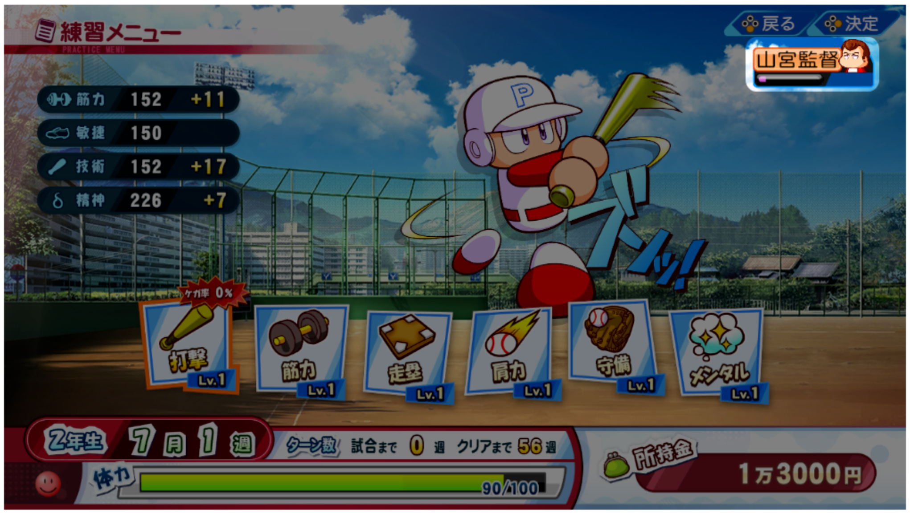

## Instruction/Help Menu Selections
サクセスに登場するキャラ -> 監督

## Instructions

1. 監督からの評価が寄付糸、試合に出場できないことがあります。
*Kantoku kara no hyouka ga kifu-ito, shiai ni shutsujou dekinai koto ga arimasu.*
If your coach gives you a low evaluation, you may not be able to play in a match.

2. 監督のいる練習を選ぶことで、評価を上げることができます。
*Kantoku no iru renshuu o erabu koto de, hyouka o ageru koto ga dekimasu.*
You can improve your evaluation by choosing to practice with the coach.