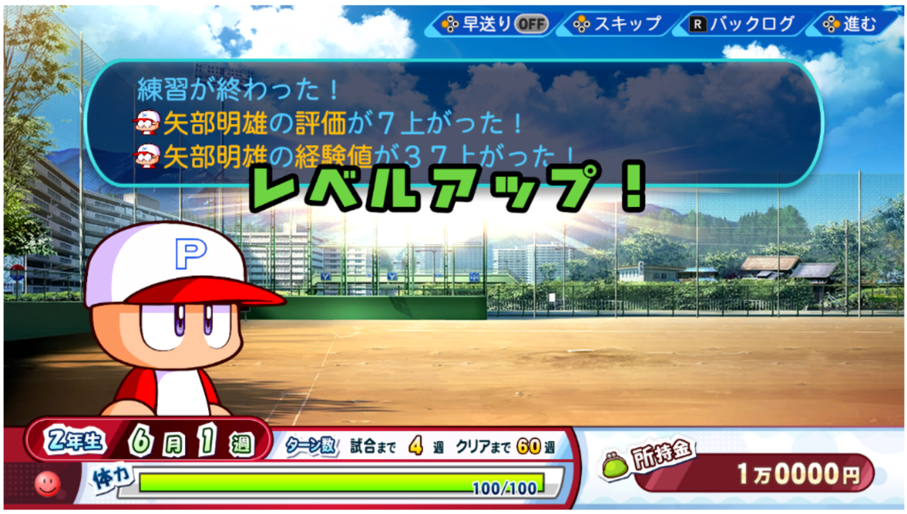
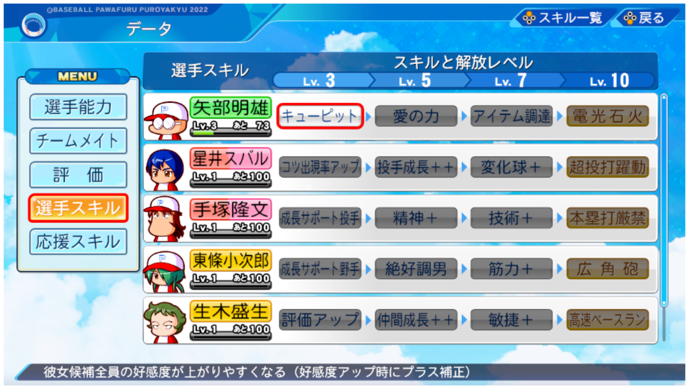
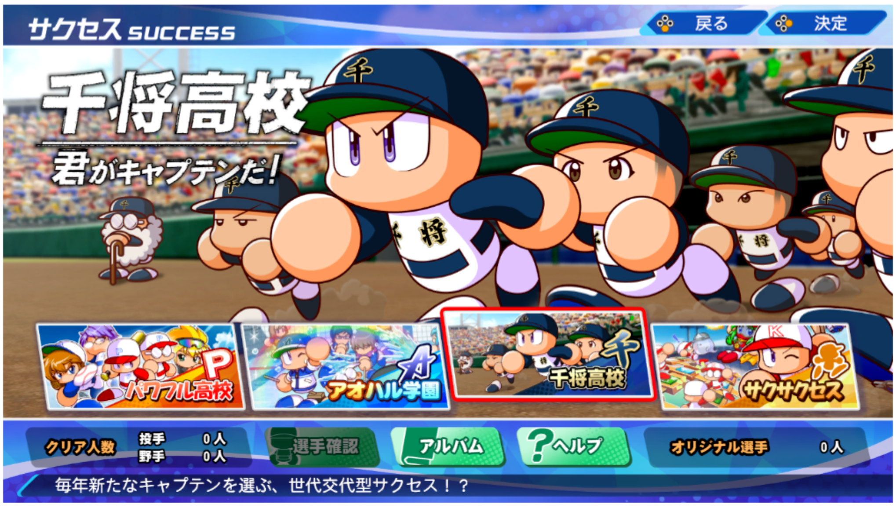

[[toc]]
<article class="prose max-w-xl lg:max-w-4xl lg:prose-lg">

## Instruction/Help Menu Selections
サクセスに登場するキャラ -> 選手キャラ

1. チームメイトの選手は、選手経験値を獲得することで選手レベルがアップしていきます。
経験値は、一緒に練習したり、試合で獲得できます。
*Chi-mumeito no senshu wa, senshu keikenchi o kakutoku suru koto de senshu reberu ga appu shite ikimasu. Keikenchi wa, issho ni renshuu shitari, shiai de kakutoku dekimasu.*
Teammate players' player levels will increase as they gain player experience points.
Experience points can be gained by practicing together or playing matches.

2. レベルアップすると選手能力が上がるほか、選手レベルが高いほど強力なスキルを習得します。
*Reberu appu suruto senshu nouryoku ga agaru hoka, senshu reberu ga takai hodo kyouryokuna sukiru o shuutoku shimasu.*
As players level up, their abilities will improve, and the higher the player level, the more powerful skills they will acquire.

3. ただし、千将高校シナリオでは独自の成長をします。ご注意ください。（詳細は千将高校のヘルプを参照）
*Tadashi, senshou koukou shinario de wa dokuji no seichou o shimasu. Go chuui kudasai. (Shousai wa senshou koukou no herupu o sanshou)*
However, in the Sensho High School scenario, they will grow in their own way. Please note. (See Sensho High School Help for details)
</article>