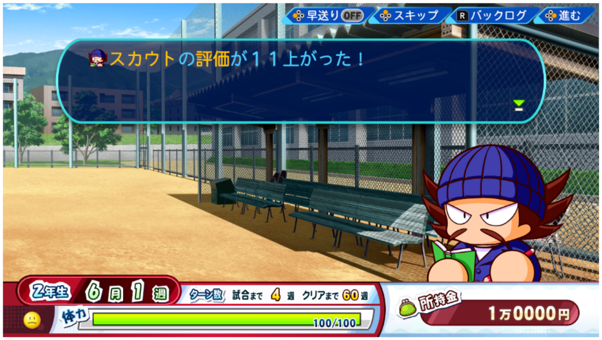

[[toc]]
<article class="prose max-w-xl lg:max-w-4xl lg:prose-lg">
## Instruction/Help Menu Selections
サクセスに登場するキャラ -> スカウト

##### 1. スカウト方の評価が高いほど、ドラフトでの指名順位も高くなります。

Sukauto hō no hyōka ga takai hodo, dorafuto de no shimei jun'i mo takaku narimasu. 

The higher the scouts' evaluation of you, the higher your draft pick will be.

##### 2. スカウトのいる練習を選んだり、試合で活躍することで、スカウトからの評価を上げることができます。

Sukauto no iru renshū o eran dari, shiai de katsuyaku suru koto de, sukauto kara no hyōka o ageru koto ga dekimasu.

You can increase the scouts' evaluation of you by choosing to attend practices where scouts are present and by performing well in games.

</article>