### サクセスの進め方

1.
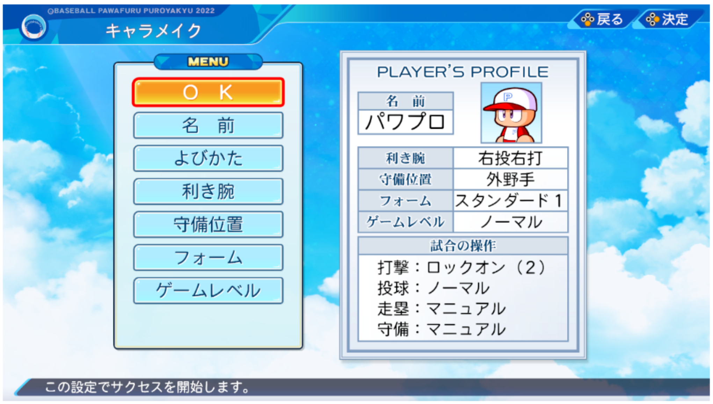

最初に、名前や利き腕、守備位置などを決めます。ゲームレベルは選んだレベルにより、試合での経験点が変動します。

Saisho ni, namae ya kikiude, shubi ichi nado o kimemasu. Gēmureberu wa eranda reberu ni yori, shiai de no keiken-ten ga hendō shimasu. 

First, you decide on a name, dominant hand, defensive position, etc. Experience points in a match will change depending on the game level you choose.

2.
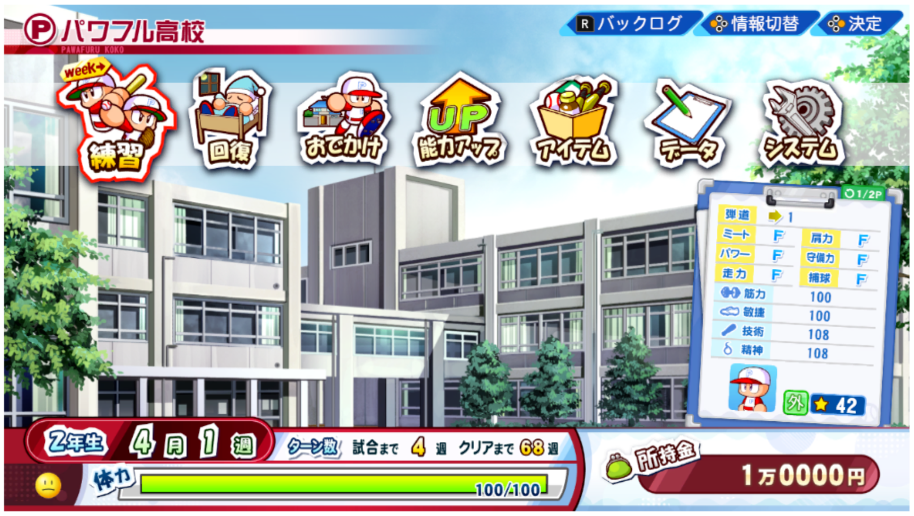

サクセスは、練習や回復、おでかけなどのコマンドを選択して1週ずつ進めていきます。

Sakusesu wa, renshū ya kaifuku, o dekake nado no komando o sentaku shite 1-shū zutsu susumete ikimasu. 

In Success Mode, you advance one week at a time by selecting commands such as Practice, Recovery, and Going Out.

3.
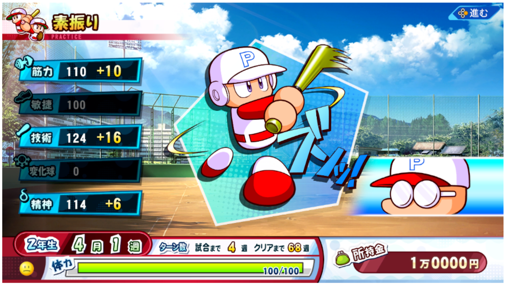

練習を実行すると、経験点を獲得できます。ただし、練習をすると体力が減っていきます。

Renshū o jikkō suru to, keiken-ten o kakutoku dekimasu. Tadashi, renshū o suruto tairyoku ga hette ikimasu. 

By practicing, you can earn experience points. However, practicing reduces your stamina.

4.
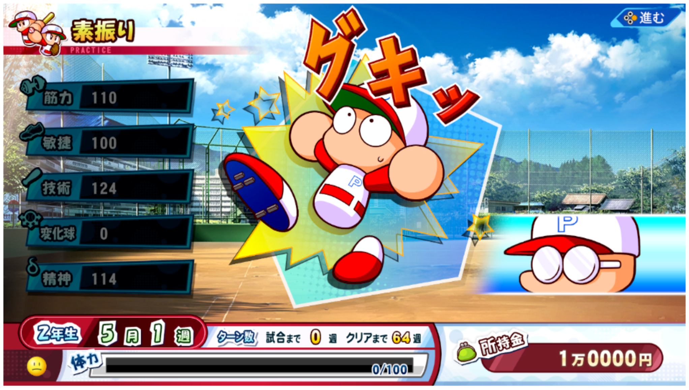

体力が減っていると練習を実行したときに、けがをしてしまい、よくない効果を受けます。体力は回復コマンドの休むを選ぶと回復します。

Tairyoku ga hette iru to renshū o jikkō shita toki ni, kega o shite shimai, yokunai kōka o ukemasu. Tairyoku wa kaifuku komando no yasumu o erabu to kaifuku shimasu. 

If your stamina is low, you will get injured when practicing and will receive bad effects. You can recover your stamina by selecting the recovery command "Rest".

5.
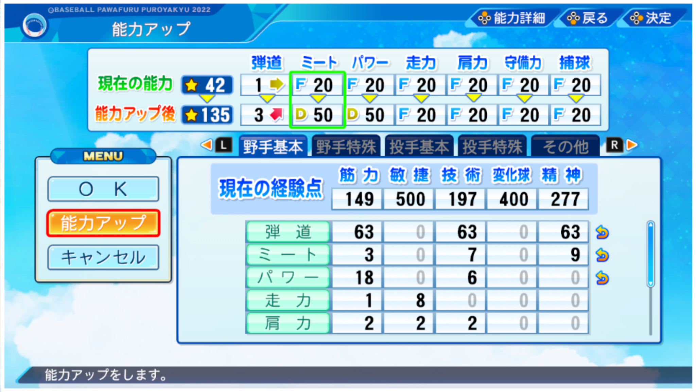

獲得した経験点は能力アップで使用して主人公の選手能力を強化することができます。

Kakutoku shita keiken-ten wa nōryoku appu de shiyō shite shujinkō no senshu nōryoku o kyōka suru koto ga dekimasu. 

You can use the experience points you earn to improve the protagonist's player abilities.

6.
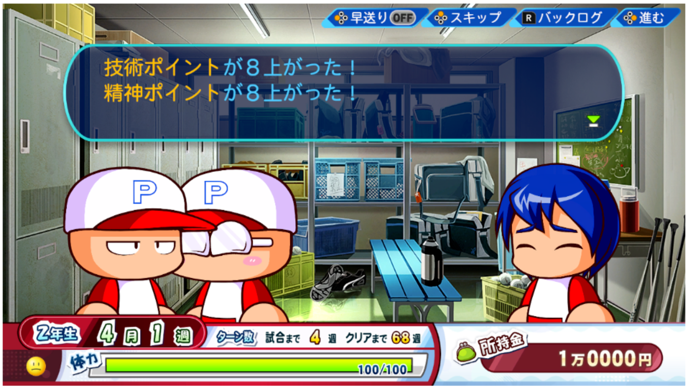

また、いろいろなイベントが発生し経験点やコツを獲得したり、やる気や体力が変動したりなどします。

Mata, iroirona ibento ga hassei shi keiken-ten ya kotsu o kakutoku shi tari, yaruki ya tairyoku ga hendō shi tari nado shimasu. 

In addition, various events will occur, allowing you to earn experience points and tips, and your motivation and stamina will change.

7.
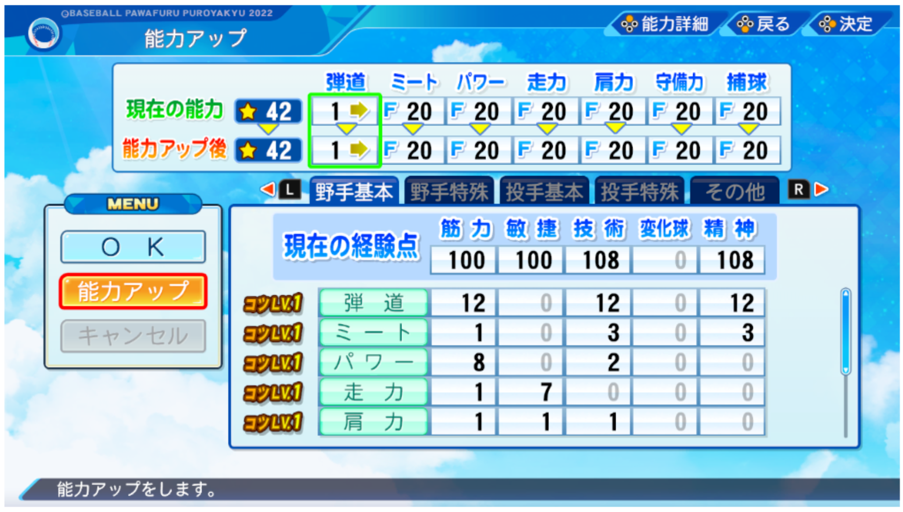

コツは能力アップで必要となる経験点が少なくなる効果があります。やる気は練習の効果やケガ率に影響があります。

Kotsu wa nōryoku appu de hitsuyō to naru keiken-ten ga sukunaku naru kōka ga arimasu. Yaruki wa renshū no kōka ya kega-ritsu ni eikyō ga arimasu. 

Skill levels have the effect of reducing the experience points required to improve abilities. Motivation affects the effectiveness of practice and the injury rate.

8.
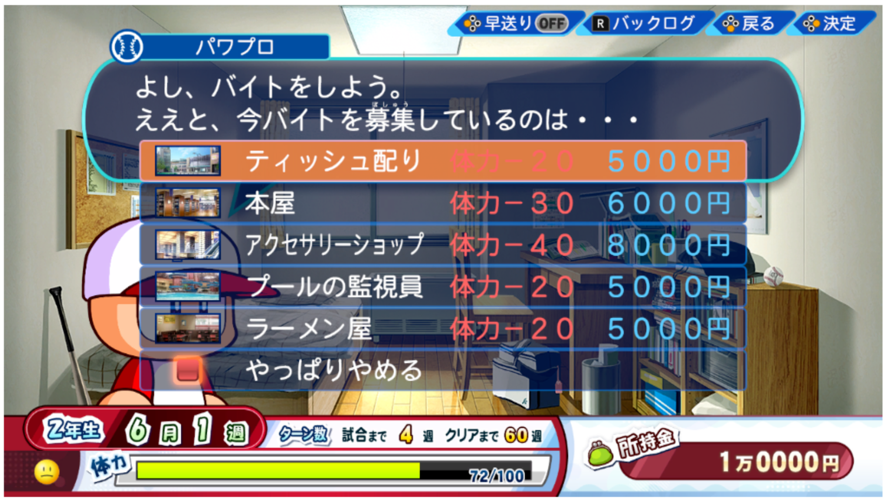

所持金を増やせるアルバイトは、イベント発生時やシナリオ専用コマンドに出現したときに行えます。選択したバイト先によって、報酬も変わります。

Shoji-kin o fuyaseru arubaito wa, ibento hassei-ji ya shinario sen'yō komando ni shutsugen shita toki ni okonaemasu. Sentaku shita baito-saki ni yotte, hōshū mo kawarimasu. 

Part-time jobs that can increase your money can be done when events occur or when they appear in scenario-specific commands. Rewards also vary depending on the part-time job you choose.

9.
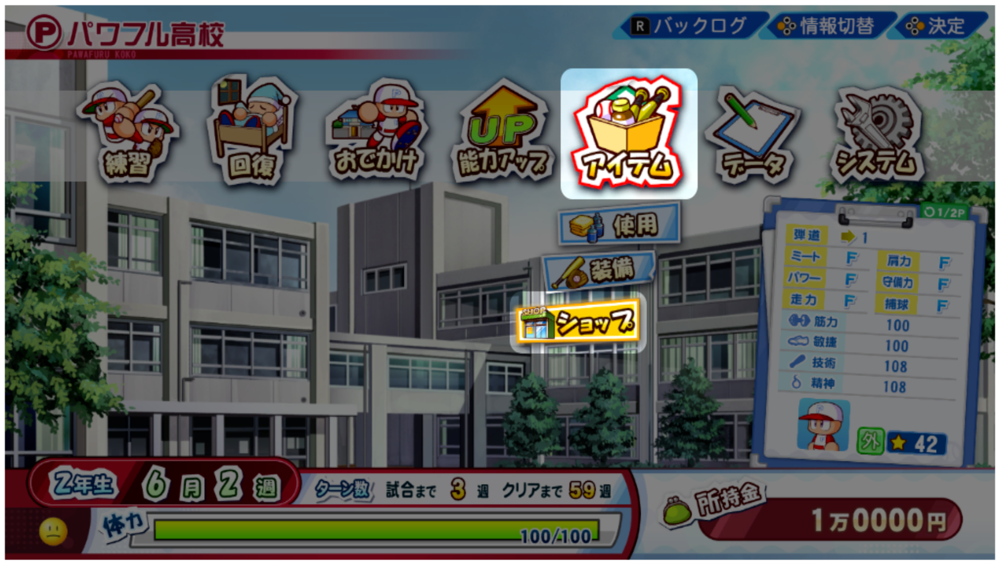

アイテムのショップコマンドが使えるようになると所持金を使用して育成に便利なアイテムを購入することができます。

Aitemu no shoppu komando ga tsukaeru yō ni naru to shoji-kin o shiyō shite ikusei ni benrina aitemu o kōnyū suru koto ga dekimasu. 

Once you have access to the item shop command, you can use your money to purchase items that are useful for training.

10.
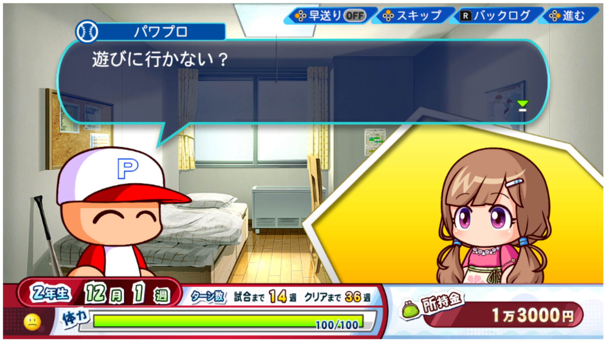

特定のキャラと出会うことで、デートに誘えます。デートには所持金を消費するものもあるので、所持金には余裕を持たせておきましょう。

Tokutei no kyara to deau koto de, dēto ni sasoemasu. Dēto ni wa shoji-kin o shōhi suru mono mo aru node, shoji-kin ni wa yoyū o mota sete okimashou. 

By meeting certain characters, you can ask them out on a date. Some dates use money, so make sure you have some extra money.

11.
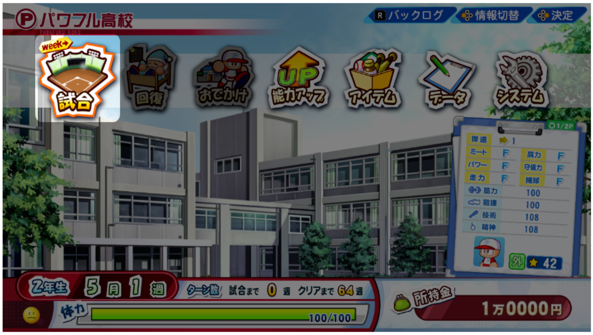

試合のある週では、練習や回復やお出かけコマンド選択後に試合アイコンが出現します。試合で活躍すればスカウトの評価がアップします。

Shiai no aru shūde wa, renshū ya kaifuku ya odekake komando sentaku-go ni shiai aikonga shutsugen shimasu. Shiai de katsuyaku sureba sukauto no hyōka ga appu shimasu. 

During weeks when there are games, the game icon will appear after selecting the practice, recovery, or go out command. If you perform well in the game, your scout's evaluation will increase.

12.
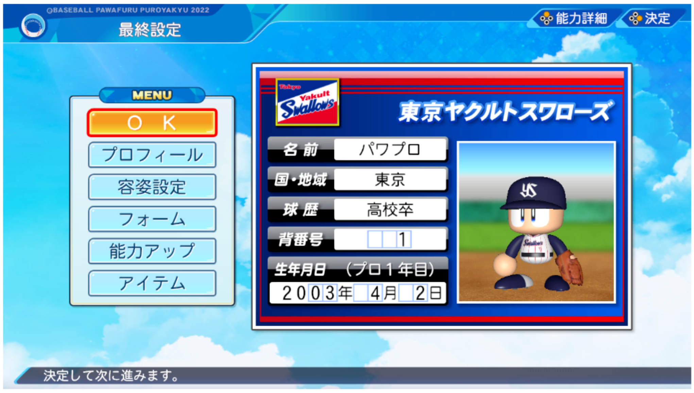

選手登録をする前にプロフィールや容姿、フォームなどを設定したり、残った経験点で能力アップをすることができます。

Senshu tōroku o suru mae ni purofīru ya yōshi, fōmu nado o settei shi tari, nokotta keiken-ten de nōryoku appu o suru koto ga dekimasu. 

Before registering a player, you can set the profile, appearance, form, etc., and use remaining experience points to improve abilities.

13.
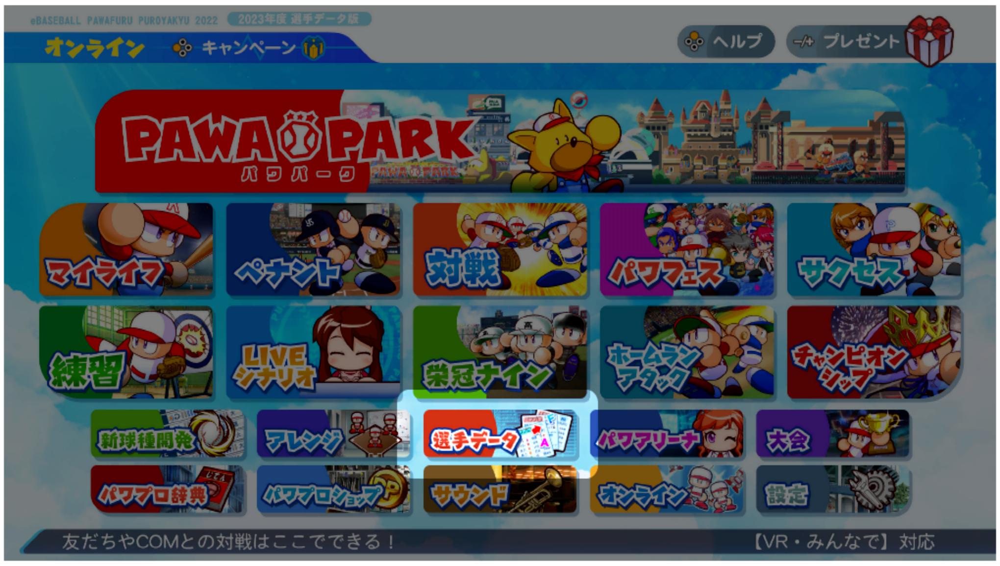

プロフィール、容姿、フォームなどの設定は選手を登録した後でも、選手データのあるオリジナル選手から変更することができます。```

Purofīru, yōshi, fōmu nado no settei wa senshu o tōroku shita nochi demo, senshu dēta no aru orijinaru senshu kara henkō suru koto ga dekimasu.

Even after registering a player, you can change the profile, appearance, form, and other settings from the original player with player data.
