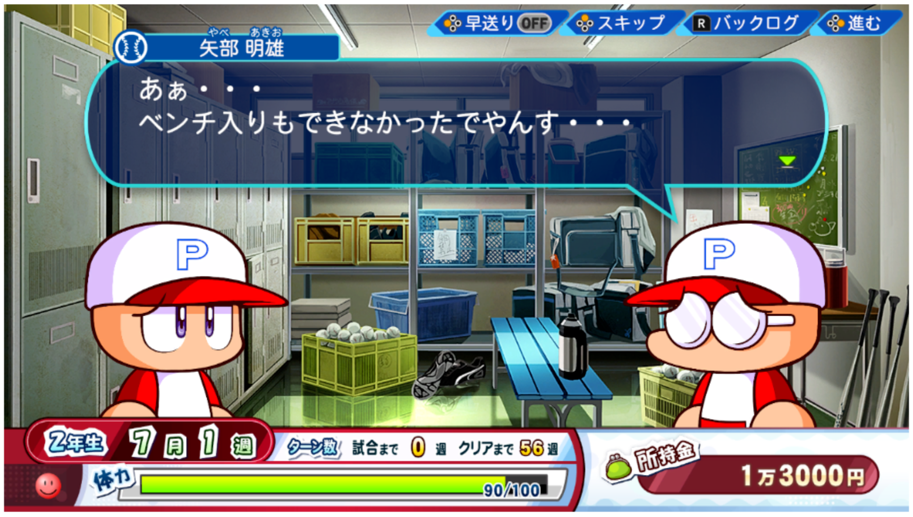
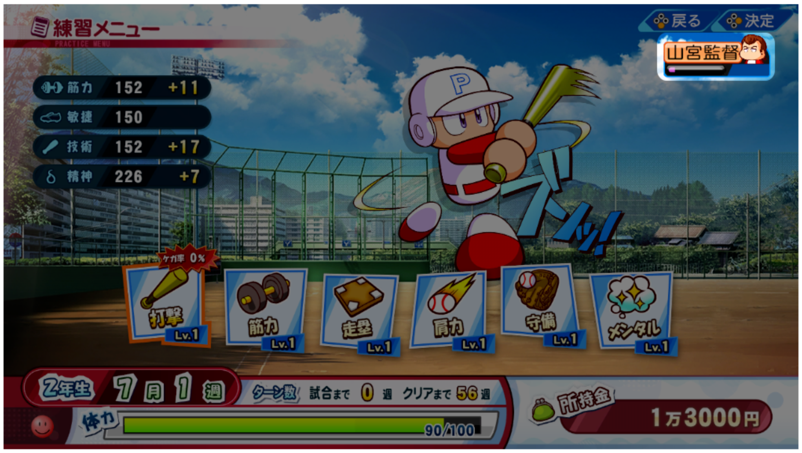

### サクセスに登場するキャラ

#### 監督

1. 

監督からの評価が寄付糸、試合に出場できないことがあります。

Kantoku kara no hyōka ga kifu-ito, shiai ni shutsujō dekinai koto ga arimasu. 

If your coach gives you a low evaluation, you may not be able to play in a match.

2. 

監督のいる練習を選ぶことで、評価を上げることができます。

Kantoku no iru renshū o erabu koto de, hyōka o ageru koto ga dekimasu.

You can improve your evaluation by choosing to practice with the coach.