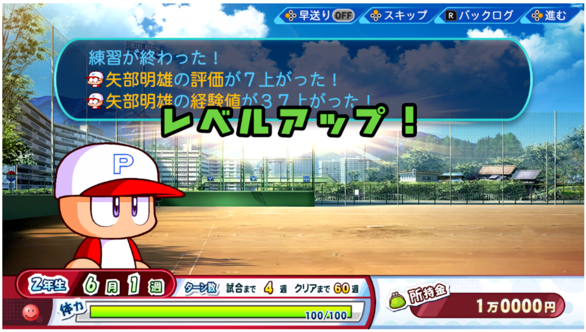
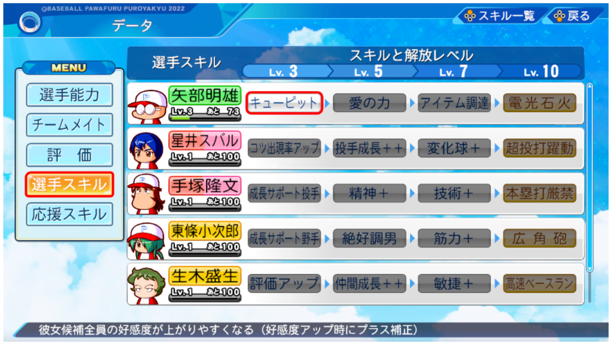
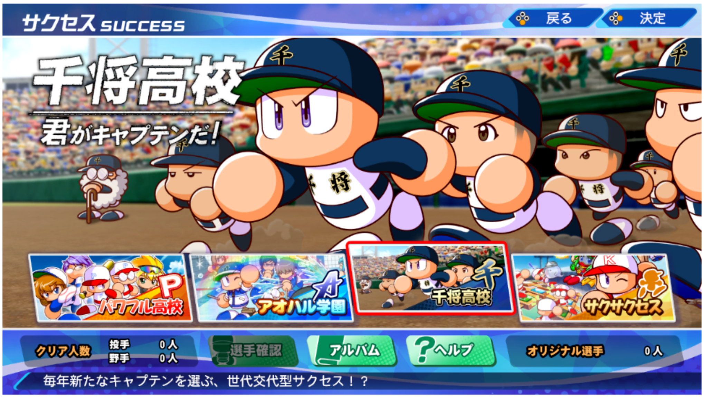

### サクセスに登場するキャラ

#### 選手キャラ

1. 

チームメイトの選手は、選手経験値を獲得することで選手レベルがアップしていきます。
経験値は、一緒に練習したり、試合で獲得できます。

Chīmumeito no senshu wa, senshu keiken-chi o kakutoku suru koto de senshu reberu ga appu shite ikimasu. Keiken-chi wa, issho ni renshū shi tari, shiai de kakutoku dekimasu.

Teammate players' player levels will increase as they gain player experience points.
Experience points can be gained by practicing together or playing matches.

2. 

レベルアップすると選手能力が上がるほか、選手レベルが高いほど強力なスキルを習得します。

Reberuappu suruto senshu nōryoku ga agaru hoka, senshu reberu ga takai hodo kyōryokuna sukiru o shūtoku shimasu.

As players level up, their abilities will improve, and the higher the player level, the more powerful skills they will acquire.

3. 

ただし、千将高校シナリオでは独自の成長をします。ご注意ください。（詳細は千将高校のヘルプを参照）

Tadashi, senshō kōkō shinario de wa dokuji no seichō o shimasu. Go chūi kudasai. (Shōsai wa senshō kōkō no herupu o sanshō)

However, in the Sensho High School scenario, they will grow in their own way. Please note. (See Sensho High School Help for details)